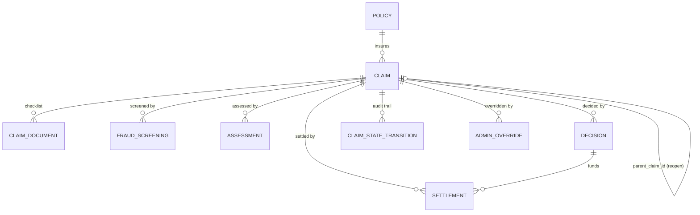

# Data Models — ClaimFlow

Companion machine-readable schema: `specs/design/data-models.schema.json` (JSON Schema draft-07).
All entities are persisted in a single SQLite file (`backend/claimflow.db`), created by the
numbered migrations in `backend/migrations/` (E3-S1). Enum values below are the closed sets from
`backend/src/types/enums.py` (E1-S1/E1-S3) — every downstream layer imports these, never
redefines them.

## Conventions

- **Money fields** (`claim_amount`, `sum_insured`, `deductible`, `co_pay`, `payable_amount`,
  `payout_amount`) are fixed-point `Decimal` in Python, stored as SQLite `TEXT` columns holding a
  canonical decimal string (e.g. `"35000.00"`), and serialized over the API as decimal-string
  fields — never JSON floats (NFR-01, Decision 6).
- **Timestamps** are ISO-8601 UTC strings (`"2026-09-06T10:15:00Z"`), stored as SQLite `TEXT`.
- **IDs** are integers (`INTEGER PRIMARY KEY AUTOINCREMENT`) unless noted; `policy_number` is a
  separate human-facing unique string key on `Policy`.
- Append-only entities (marked below) have repositories exposing `insert()` / `get_*()` /
  `list_*()` only — no `update()` or `delete()` (E3-S4 AC2).

---

## 1. Enums (Types layer, E1-S1 / E1-S3)

| Enum | Values |
|---|---|
| `Role` | `CUSTOMER`, `ASSESSOR`, `ADMIN` |
| `ClaimType` | `MOTOR`, `HEALTH`, `LIFE` |
| `PolicyStatus` | `ACTIVE`, `LAPSED`, `EXPIRED`, `CANCELLED` (documented assumption: BRD §9 specifies `ACTIVE`/`LAPSED`/"..."; `EXPIRED` and `CANCELLED` are added as the two other realistic terminal-inactive states so `is_active_on()` has concrete non-ACTIVE values to test against) |
| `ClaimStatus` | `INTAKE`, `DOCS_PENDING`, `FRAUD_SCREENING`, `ASSESSMENT`, `AUTO_APPROVED`, `MANUAL_REVIEW`, `REJECTED`, `SETTLED`, `REOPENED`, `PROCESSING_FAILED` (exactly these 10, per E1-S1 AC2) |
| `DocumentType` | `POLICE_FIR`, `INVOICE` (motor); `HOSPITAL_BILL`, `DISCHARGE_SUMMARY` (health); `DEATH_CERTIFICATE` (life) |
| `VerificationStatus` | `VERIFIED`, `MISSING` |
| `DecisionOutcome` | `AUTO_APPROVE`, `MANUAL_REVIEW`, `REJECT` (deliberately distinct spelling from `ClaimStatus.AUTO_APPROVED`/`REJECTED`: `DecisionOutcome` is the assessor/engine's verb-form recommendation, `ClaimStatus` is the claim's noun-form current state — a `DecisionOutcome.AUTO_APPROVE` drives a `transition()` call into `ClaimStatus.AUTO_APPROVED`) |
| `ReasonCode` (closed domain set, E1-S3 AC1 — used on `Decision`/`PolicyNotActiveException`) | `POLICY_INACTIVE`, `ZERO_PAYABLE_AMOUNT`, `FRAUD_FLAG`, `AUTO_APPROVED_LOW_RISK`, `HIGH_VALUE_REVIEW`, `DOCS_INCOMPLETE` — exactly these 6 |
| `ApiErrorCode` (broader HTTP error-envelope set, API layer only, not persisted) | `POLICY_INACTIVE`, `DUPLICATE_CLAIM`, `INVALID_STATE_TRANSITION`, `VALIDATION_ERROR`, `UNKNOWN_CLAIM_TYPE`, `UNAUTHORIZED`, `FORBIDDEN`, `NOT_FOUND`, `PROCESSING_FAILED` — superset used only in HTTP error bodies (see `api-contracts.md`); the 6-value `ReasonCode` above is a subset used specifically on `Decision` rows and `PolicyNotActiveException`. This split resolves the apparent tension between E1-S3 AC1's *exactly 6* `ReasonCode` values and E9-S1 AC2's requirement that a duplicate-FNOL response carries `reason_code: DUPLICATE_CLAIM` — `DUPLICATE_CLAIM` is an API error code, never written to a `Decision` row. |
| `AdminOverrideCommand` | `FORCE_APPROVE`, `FORCE_REJECT`, `FORCE_MANUAL_REVIEW`, `FORCE_RETRY` |

### 1.1 Claim state-machine transition table (E1-S2)

`transition(claim, event) -> ClaimStateTransition`, backed by this `{FROM_STATE: {EVENT: TO_STATE}}`
table. Every `ClaimStatus` value is a key, including terminal states (with an explicit empty event
set — no implicit fallthrough, per E1-S2 AC3).

| From state | Event | To state |
|---|---|---|
| `INTAKE` | `ATTACH_CHECKLIST` | `DOCS_PENDING` |
| `DOCS_PENDING` | `DOCS_VERIFIED` | `FRAUD_SCREENING` |
| `DOCS_PENDING` | `ADMIN_FORCE_REJECT` | `REJECTED` |
| `FRAUD_SCREENING` | `FRAUD_CLEARED` | `ASSESSMENT` |
| `FRAUD_SCREENING` | `FRAUD_FLAGGED` | `MANUAL_REVIEW` |
| `FRAUD_SCREENING` | `PIPELINE_ERROR` | `PROCESSING_FAILED` |
| `FRAUD_SCREENING` | `ADMIN_FORCE_REJECT` | `REJECTED` |
| `ASSESSMENT` | `DECISION_AUTO_APPROVE` | `AUTO_APPROVED` |
| `ASSESSMENT` | `DECISION_MANUAL_REVIEW` | `MANUAL_REVIEW` |
| `ASSESSMENT` | `DECISION_REJECT` | `REJECTED` |
| `ASSESSMENT` | `PIPELINE_ERROR` | `PROCESSING_FAILED` |
| `MANUAL_REVIEW` | `ASSESSOR_APPROVE` | `AUTO_APPROVED` |
| `MANUAL_REVIEW` | `ASSESSOR_REJECT` | `REJECTED` |
| `MANUAL_REVIEW` | `ADMIN_FORCE_APPROVE` | `AUTO_APPROVED` |
| `MANUAL_REVIEW` | `ADMIN_FORCE_REJECT` | `REJECTED` |
| `MANUAL_REVIEW` | `ADMIN_FORCE_MANUAL_REVIEW` | `MANUAL_REVIEW` |
| `AUTO_APPROVED` | `SETTLE` | `SETTLED` |
| `REJECTED` | *(none — terminal)* | — |
| `SETTLED` | `REOPEN` | `REOPENED` |
| `REOPENED` | *(none — terminal marker on the original claim; the new sub-claim is an independent row starting at `INTAKE`)* | — |
| `PROCESSING_FAILED` | `RETRY_TO_DOCS_PENDING` | `DOCS_PENDING` |
| `PROCESSING_FAILED` | `RETRY_TO_FRAUD_SCREENING` | `FRAUD_SCREENING` |
| `PROCESSING_FAILED` | `RETRY_TO_ASSESSMENT` | `ASSESSMENT` |
| `PROCESSING_FAILED` | `ADMIN_FORCE_REJECT` | `REJECTED` |

Any event not listed for the claim's current state raises `InvalidClaimStateException` and leaves
`claim.status` unchanged (E1-S2 AC2).

---

## 2. Entities

### 2.1 Policy

| Field | Type | Constraints |
|---|---|---|
| `id` | integer | PK, autoincrement |
| `policy_number` | string | unique, not null |
| `product_type` | `ClaimType` | not null |
| `status` | `PolicyStatus` | not null |
| `sum_insured` | Decimal | not null, > 0 |
| `effective_date` | date (ISO `YYYY-MM-DD`) | not null |
| `expiry_date` | date | not null, >= `effective_date` |
| `created_at` | timestamp | not null, set on insert |

**Relationships:** one `Policy` has many `Claim` (`Claim.policy_id -> Policy.id`).
**Indexes:** unique index on `policy_number`; index on `status` (used by intake validation).
**Behavior:** `is_active_on(date)` returns `True` iff `status == ACTIVE` and
`effective_date <= date <= expiry_date` (E3-S2 AC3).

**Example:**
```json
{
  "id": 1,
  "policy_number": "POL-MOTOR-0001",
  "product_type": "MOTOR",
  "status": "ACTIVE",
  "sum_insured": "100000.00",
  "effective_date": "2026-01-01",
  "expiry_date": "2026-12-31",
  "created_at": "2026-01-01T00:00:00Z"
}
```

### 2.2 Claim

| Field | Type | Constraints |
|---|---|---|
| `id` | integer | PK, autoincrement |
| `policy_id` | integer | FK -> `Policy.id`, not null |
| `claim_type` | `ClaimType` | not null |
| `incident_date` | date | not null |
| `claim_amount` | Decimal | not null, > 0 |
| `status` | `ClaimStatus` | not null, default `INTAKE`; mutated only via the E1-S2 gate |
| `parent_claim_id` | integer, nullable | FK -> `Claim.id`; set only when created via `reopen()` (E7-S2) |
| `created_at` | timestamp | not null |
| `updated_at` | timestamp | not null, bumped on every state transition |

**Relationships:** many `Claim` -> one `Policy`; self-referential `parent_claim_id` for the
dispute/reopen chain; one `Claim` has many `ClaimDocument`, `FraudScreening`, `Assessment`,
`Decision`, `Settlement`, `ClaimStateTransition`, `AdminOverride`.
**Indexes:** index on `policy_id`; index on `status` (queue filtering); index on `claim_type`;
index on `parent_claim_id`; composite index on `(policy_id, incident_date)` (duplicate-detection
lookup, E4-S3).

**Example:**
```json
{
  "id": 42,
  "policy_id": 1,
  "claim_type": "MOTOR",
  "incident_date": "2026-03-10",
  "claim_amount": "40000.00",
  "status": "AUTO_APPROVED",
  "parent_claim_id": null,
  "created_at": "2026-03-11T09:00:00Z",
  "updated_at": "2026-03-11T09:05:00Z"
}
```

### 2.3 ClaimDocument

| Field | Type | Constraints |
|---|---|---|
| `id` | integer | PK, autoincrement |
| `claim_id` | integer | FK -> `Claim.id`, not null |
| `document_type` | `DocumentType` | not null; must belong to the claim's own `claim_type` checklist (E5-S1 AC4) |
| `verification_status` | `VerificationStatus` | not null, default `MISSING` |
| `created_at` | timestamp | not null |
| `updated_at` | timestamp | not null, bumped when toggled |

**Relationships:** many `ClaimDocument` -> one `Claim`.
**Indexes:** index on `claim_id`; unique composite index on `(claim_id, document_type)`.
**Checklist by claim type:** `MOTOR` -> {`POLICE_FIR`, `INVOICE`}; `HEALTH` -> {`HOSPITAL_BILL`,
`DISCHARGE_SUMMARY`}; `LIFE` -> {`DEATH_CERTIFICATE`}.

**Example:**
```json
{ "id": 100, "claim_id": 42, "document_type": "POLICE_FIR", "verification_status": "VERIFIED",
  "created_at": "2026-03-11T09:00:00Z", "updated_at": "2026-03-11T09:02:00Z" }
```

### 2.4 FraudScreening (append-only)

| Field | Type | Constraints |
|---|---|---|
| `id` | integer | PK, autoincrement |
| `claim_id` | integer | FK -> `Claim.id`, not null |
| `score` | integer | not null, >= 0, sum of triggered rule weights |
| `breakdown` | JSON (TEXT) | not null; array of `{ "rule_name": string, "weight": integer }` |
| `threshold` | integer | not null; the threshold *active at scoring time* (snapshot, E5-S3 AC1), not a live re-read of config |
| `flagged` | boolean | not null; `score >= threshold` |
| `created_at` | timestamp | not null |

**Relationships:** many `FraudScreening` -> one `Claim` (multiple rows per claim across retries,
NFR-02).
**Indexes:** index on `claim_id`; index on `(claim_id, created_at)` for "latest screening" lookup.
**Insert-only:** no `update()`/`delete()` in the repository.

**Example:**
```json
{ "id": 7, "claim_id": 42, "score": 65,
  "breakdown": [ {"rule_name": "HIGH_CLAIM_TO_SUM_RATIO", "weight": 40},
                 {"rule_name": "EARLY_FILING", "weight": 25} ],
  "threshold": 60, "flagged": true, "created_at": "2026-03-11T09:03:00Z" }
```

### 2.5 Assessment (append-only)

| Field | Type | Constraints |
|---|---|---|
| `id` | integer | PK, autoincrement |
| `claim_id` | integer | FK -> `Claim.id`, not null |
| `claim_amount` | Decimal | not null; snapshot of `Claim.claim_amount` at assessment time |
| `sum_insured` | Decimal | not null; snapshot of `Policy.sum_insured` at assessment time |
| `deductible` | Decimal | not null, >= 0 |
| `co_pay` | Decimal | not null, >= 0 |
| `payable_amount` | Decimal | not null, >= 0 (clamped, NFR-01/AC-05 invariant) |
| `created_at` | timestamp | not null |

**Relationships:** many `Assessment` -> one `Claim`.
**Indexes:** index on `(claim_id, created_at)` for "latest assessment" lookup (E3-S4 AC3).
**Insert-only.**

**Example (health claim, claim_amount 20000):**
```json
{ "id": 12, "claim_id": 55, "claim_amount": "20000.00", "sum_insured": "300000.00",
  "deductible": "1000.00", "co_pay": "1900.00", "payable_amount": "17100.00",
  "created_at": "2026-04-02T10:00:00Z" }
```

### 2.6 Decision (append-only)

| Field | Type | Constraints |
|---|---|---|
| `id` | integer | PK, autoincrement |
| `claim_id` | integer | FK -> `Claim.id`, not null |
| `outcome` | `DecisionOutcome` | not null |
| `reason_code` | `ReasonCode` | not null |
| `decided_by` | string | not null; `"system"` or an assessor `actor_id` (E6-S2 AC5) |
| `created_at` | timestamp | not null |

**Relationships:** many `Decision` -> one `Claim`; one `Decision` -> zero-or-one `Settlement`
(only `AUTO_APPROVE` outcomes ever get a settlement).
**Indexes:** index on `(claim_id, created_at)`.
**Insert-only.**

**Example:**
```json
{ "id": 30, "claim_id": 42, "outcome": "AUTO_APPROVE", "reason_code": "AUTO_APPROVED_LOW_RISK",
  "decided_by": "system", "created_at": "2026-03-11T09:04:00Z" }
```

### 2.7 Settlement (append-only, immutable)

| Field | Type | Constraints |
|---|---|---|
| `id` | integer | PK, autoincrement |
| `claim_id` | integer | FK -> `Claim.id`, not null |
| `decision_id` | integer | FK -> `Decision.id`, not null |
| `payout_amount` | Decimal | not null, >= 0; equals the decision-time `payable_amount` |
| `payment_reference` | string | not null; stub confirmation reference (E7-S1 AC3), never a real payment-rail identifier |
| `created_at` | timestamp | not null |

**Relationships:** many `Settlement` -> one `Claim`; many-to-one -> `Decision`. In practice at
most one `Settlement` per terminal `AUTO_APPROVED` claim, but the schema does not forbid more
(e.g. a future re-settlement of a reopened+re-approved sub-claim would be its own new `Claim` row
with its own `Settlement`).
**Indexes:** index on `claim_id`; index on `created_at` (reverse-chronological audit trail,
E9-S4 AC2 / E11-S4 AC2).
**Insert-only, no update method at all — immutability is structural, not just convention
(E7-S1 AC2).**

**Example:**
```json
{ "id": 9, "claim_id": 42, "decision_id": 30, "payout_amount": "35000.00",
  "payment_reference": "STUB-PAY-0000042-01", "created_at": "2026-03-11T09:05:00Z" }
```

### 2.8 ClaimStateTransition (append-only audit trail)

| Field | Type | Constraints |
|---|---|---|
| `id` | integer | PK, autoincrement |
| `claim_id` | integer | FK -> `Claim.id`, not null |
| `from_state` | `ClaimStatus` | not null |
| `to_state` | `ClaimStatus` | not null |
| `event` | string | not null; one of the event names in §1.1 |
| `actor_id` | string, nullable | who triggered the transition (`"system"`, a customer/assessor/admin actor id, or null for system-internal steps) |
| `created_at` | timestamp | not null |

**Relationships:** many `ClaimStateTransition` -> one `Claim`.
**Indexes:** index on `(claim_id, created_at)`.
**Insert-only** — every `transition()` call returns exactly one of these for the caller to
persist in the same DB transaction as the `Claim.status` update (E1-S2 AC4, E3-S3 AC2).

**Example:**
```json
{ "id": 200, "claim_id": 42, "from_state": "DOCS_PENDING", "to_state": "FRAUD_SCREENING",
  "event": "DOCS_VERIFIED", "actor_id": "assessor-1", "created_at": "2026-03-11T09:02:30Z" }
```

### 2.9 AdminOverride (append-only audit trail)

| Field | Type | Constraints |
|---|---|---|
| `id` | integer | PK, autoincrement |
| `claim_id` | integer | FK -> `Claim.id`, not null |
| `admin_actor_id` | string | not null |
| `command` | `AdminOverrideCommand` | not null |
| `reason_code` | string | not null, min length 1 (mandatory, E8-S2 AC2) |
| `created_at` | timestamp | not null |

**Relationships:** many `AdminOverride` -> one `Claim`.
**Indexes:** index on `(claim_id, created_at)` (E3-S4 AC4: ordered ascending for
`list_admin_overrides()`).
**Insert-only.**

**Example:**
```json
{ "id": 5, "claim_id": 77, "admin_actor_id": "admin-1", "command": "FORCE_APPROVE",
  "reason_code": "Manual goodwill approval after phone review", "created_at": "2026-04-05T14:00:00Z" }
```

---

## 3. Non-persisted supporting types

### 3.1 ActorContext (Types layer value object, not a DB entity)

Produced per-request by the E8-S1 auth dependency from the `X-Role` / `X-Actor-Id` headers; never
written to the database. Shape:

| Field | Type |
|---|---|
| `role` | `Role` |
| `actor_id` | string |

### 3.2 FraudRuleBreakdownEntry (embedded in `FraudScreening.breakdown`, not a separate table)

| Field | Type |
|---|---|
| `rule_name` | string (one of: `HIGH_CLAIM_TO_SUM_RATIO`, `EARLY_FILING`, `CLAIM_FREQUENCY`, `MOTOR_MISSING_FIR`, `ROUND_NUMBER_CLAIM`) |
| `weight` | integer |

---

## 4. Entity-Relationship Summary


