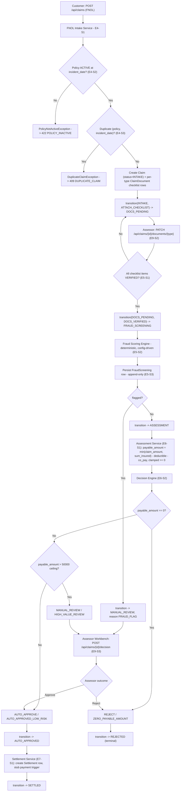
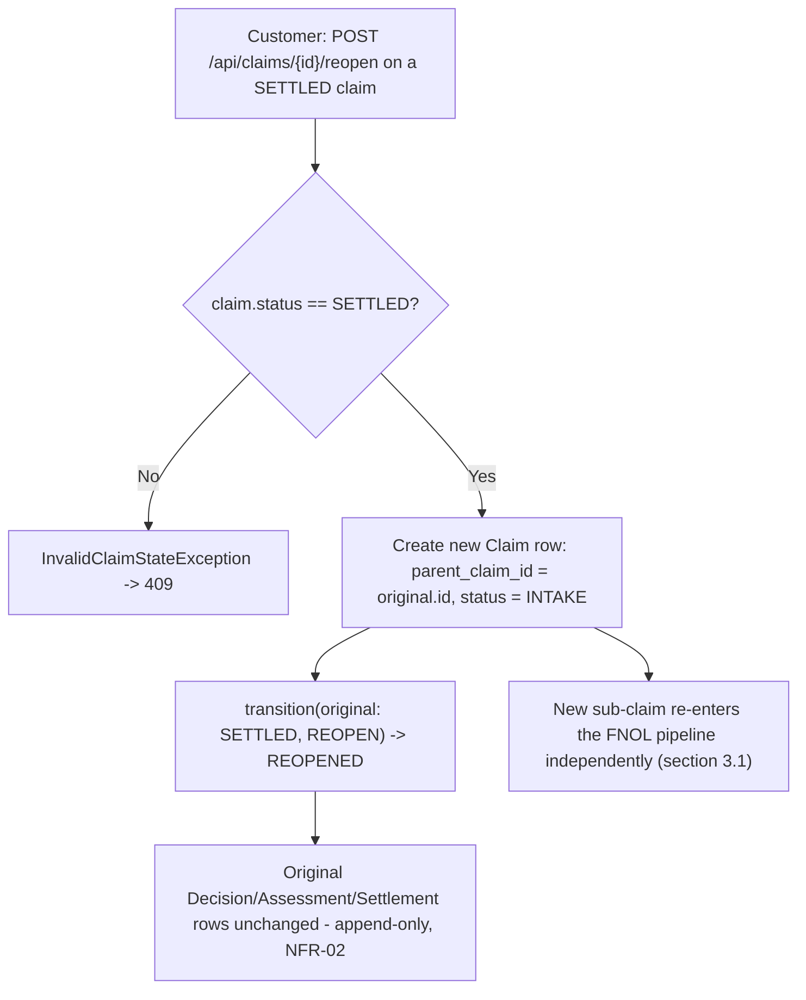
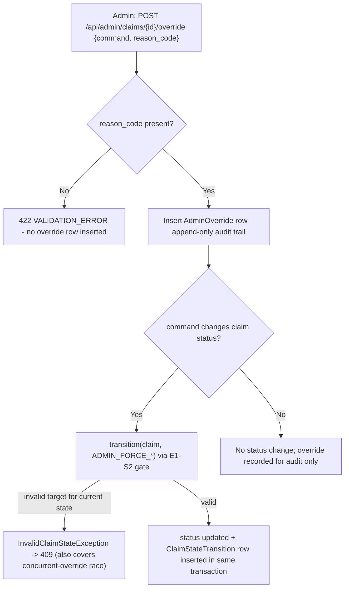
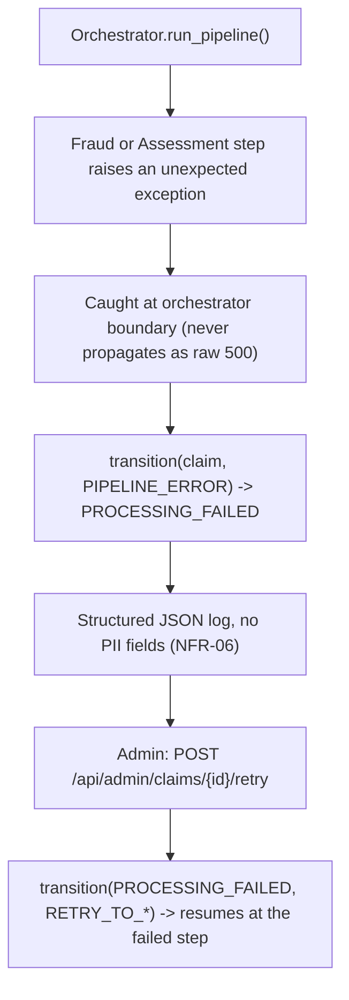
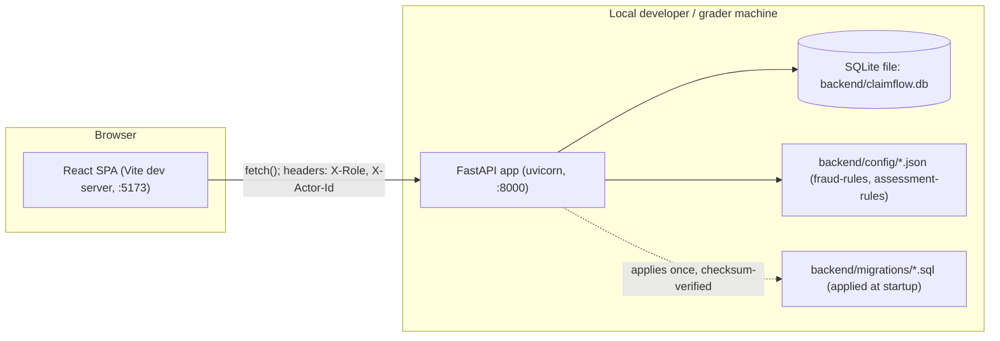

# System Design — ClaimFlow

**Status:** Design — feeds code generation directly (no-hand-coding rule: this document plus its
sibling schemas must be precise enough that a builder agent needs no guesswork).
**Source of truth inputs:** `specs/brd/brd.md`, `specs/stories/*.md` (34 stories, epics E1–E11),
`specs/stories/dependency-graph.md`, `CLAUDE.md`, `project-manifest.json`, `.gitlab-ci.yml`,
`.claude/architecture.md`.

---

## 1. Overview

ClaimFlow is a **strict layered monolith** (not microservices) that takes a claim from First
Notice of Loss (FNOL) through document verification, deterministic fraud screening, financial
assessment, decision, and settlement, with a controlled dispute/reopen path and an admin
override/audit path. One FastAPI backend process serves a REST API over a single SQLite database
file; one Vite/React SPA consumes that API for three role-scoped surfaces (Customer, Assessor,
Admin). There is no BFF, no message queue, no secondary datastore, and no external network
integration — everything "external" (payment disbursement, document storage) is a stub inside the
application boundary, consistent with BRD §10.

---

## 2. Component Architecture

### 2.1 Layering (Decision 1)

The dependency graph's groups A–K collapse onto a fixed six-layer stack. Imports are **one-way
only**: a layer may import from layers strictly to its left/below; never the reverse. This is
enforced mechanically by the `check-architecture` hook and by structural tests (NFR-08).

```
Types (A)  →  Config (B)  →  Repository (C/D)  →  Service (E/F/G/H/I)  →  API (C,G,H,I)  →  UI (G-K)
```

| Layer | Backend location | Frontend location | May import from |
|---|---|---|---|
| Types | `backend/src/types/` | `frontend/src/types/` | (nothing) |
| Config | `backend/src/config/` | `frontend/src/config/` | Types |
| Repository | `backend/src/repositories/`, `backend/src/db/` | — (no repository layer in frontend; API calls fill this role) | Types, Config |
| Service | `backend/src/services/` | — (no service layer in frontend) | Types, Config, Repository |
| API | `backend/src/api/` | `frontend/src/api/` (client, not server) | Types, Config, Repository, Service |
| UI | — | `frontend/src/components/`, `frontend/src/features/`, `frontend/src/pages/` | Types, Config, (frontend) API client |

The frontend has no repository/service layers of its own; it talks directly to the FastAPI REST
API (Decision 10: no BFF layer at this scale). Frontend `src/api/` is the frontend's analogue of
the "API" layer boundary — UI components never call `fetch` directly, only through `src/api/*`.

### 2.2 Components

| Component | Responsibility |
|---|---|
| **Types module** (`backend/src/types`) | Single source of truth for `Policy`, `Claim`, `ClaimDocument`, `FraudScreening`, `Assessment`, `Decision`, `Settlement`, `ClaimStateTransition`, `AdminOverride`, and the `Role` / `ClaimType` / `ClaimStatus` / `DocumentType` / `VerificationStatus` / `DecisionOutcome` / `ReasonCode` enums (Decision 5), plus the domain exceptions (E1-S3) and the claim state-machine transition gate (E1-S2, Decision 5). |
| **Config module** | Loads `config/fraud-rules.json` (E2-S1), `config/assessment-rules.json` (E2-S2), and `AppConfig` (E2-S3: db path, ports, `valid_roles`) at startup, failing fast on missing/malformed config. |
| **Migration runner + repositories** | Hand-numbered append-only SQL migrations (E3-S1, Decision 4) create the 9 tables; one repository class per aggregate wraps raw SQL (`sqlite3`), with FraudScreening/Assessment/Decision/Settlement/AdminOverride repositories exposing **insert-only** interfaces (Decision 8). |
| **Service layer** | FNOL intake (E4), document checklist enforcement (E5-S1), the deterministic fraud scoring engine (E5-S2, Decision 7), assessment (E6-S1), decision engine (E6-S2, Decision 7), pipeline orchestration with failure handling (E6-S3), settlement (E7-S1), reopen/dispute (E7-S2), admin override (E8-S2). Every status mutation goes through the E1-S2 transition gate — no service sets `claim.status` directly (Decision 5, NFR-08). |
| **API layer** | The stubbed role-based auth dependency (E8-S1, Decision 9), and four routers: claims (E9-S1), document verification (E9-S2), assessor workbench (E9-S3), admin (E9-S4). Exception → HTTP status mapping lives here (E1-S3 AC4). |
| **UI layer** | Customer portal (E10: FNOL form, tracker, dispute — responsive) and Internal portal (E11: document queue, fraud queue, assessor workbench, admin dashboard — desktop-only), per Decision 10/11. |

---

## 3. Data Flows

### 3.1 Primary pipeline: FNOL → settlement



### 3.2 Dispute / reopen flow (E7-S2, E10-S3)



### 3.3 Admin override flow (E8-S2, E9-S4, E11-S4)



### 3.4 Pipeline failure / retry flow (E6-S3)



---

## 4. Infrastructure Topology (Decision 11 — local only)



There is exactly one deployment target: **local**, bootstrapped by the repo-root `init.sh`
(installs backend + frontend dependencies, starts uvicorn on `:8000` and the Vite dev server on
`:5173`). GitLab CI (`.gitlab-ci.yml`) runs **lint and test stages only** — there is no deploy
stage, no container image, no cloud target. This matches `project-manifest.json`'s
`"deployment": {"method": "local"}` and is documented, not treated as a gap. See
`deployment.md` for the full workflow and a forward-looking, clearly-labeled staging/prod section.

---

## 5. Key Design Decisions (numbered to match the accepted architecture direction)

1. **Strict layered monolith.** Layer order Types → Config → Repository → Service → API → UI is
   fixed by the dependency graph's groups A–K. One-way imports only; no circular deps. Chosen over
   microservices because the app is single-process, single-database, single-operator (BRD §8) —
   service boundaries would add deployment/ops overhead with no rubric benefit.
2. **Backend: Python 3.12 / FastAPI / pip / ruff / mypy / pytest**, rooted at `backend/` with
   `backend/src/` and `backend/requirements.txt`, because `.gitlab-ci.yml` invokes exactly these
   paths and tools; this is a hard constraint, not a preference.
3. **Frontend: TypeScript / React / Vite / npm / eslint / tsc / vitest / Playwright**, rooted at
   `frontend/`, for the same CI-fixed-path reason.
4. **Database: SQLite only**, single local file, no ORM auto-migration tool. Migrations are
   hand-numbered, append-only SQL scripts (`migrations/0001_*.sql`, ...), applied once and never
   edited (E3-S1); repository classes wrap raw SQL via `sqlite3`. One repository per aggregate
   (Policy; Claim; and one each for the append-only audit trails — FraudScreening, Assessment,
   Decision, Settlement, AdminOverride — per E3-S4). Chosen (BRD §7.5) because a single small
   SQLite schema does not need Alembic's autogeneration/multi-DB abstraction.
5. **Domain modeling.** A central `backend/src/types` module (E1-S1) is the single source of truth
   for all entities and enums, imported by every other layer — never redefined downstream. A
   dedicated state-machine transition gate module (E1-S2) is the **only** place claim status is
   mutated; every service calls `transition(claim, event)` rather than assigning `claim.status`
   directly. This is what makes NFR-08 mechanically testable (a structural test can grep for
   direct `status =` assignments outside the gate module).
6. **Money.** Every monetary field (`claim_amount`, `sum_insured`, deductible/co-pay,
   `payable_amount`, settlement `payout_amount`) is a fixed-point `Decimal` end-to-end — never
   `float` — satisfying NFR-01. JSON wire representations use decimal-formatted strings (see
   `api-contracts.md` conventions) to avoid float round-tripping through JSON numbers.
7. **Determinism.** Fraud scoring (E5-S2) and the decision engine (E6-S2) are pure, deterministic
   rule evaluators driven by declarative JSON config (`config/fraud-rules.json`,
   `config/assessment-rules.json`, loaded per E2-S1/E2-S2). No ML/LLM calls, no randomness, no
   wall-clock-dependent branching in the scoring math itself. Identical input always yields an
   identical score/breakdown (AC-04) — this is asserted directly by E5-S2 AC-03.
8. **Append-only records.** Claims (status changes only via new `ClaimStateTransition` rows plus a
   status column update in the same transaction), fraud screenings, assessments, decisions,
   settlements, and admin overrides are never updated or deleted in place; new rows represent state
   changes. Repository interfaces for these five entities expose no `update()`/`delete()` method at
   all (E3-S4 AC2), which is itself a structural test target.
9. **Auth.** A lightweight stub FastAPI dependency (E8-S1) reads `X-Role` and an actor-id header
   (`X-Actor-Id`), validates the role string against `AppConfig.valid_roles`, and injects an
   `ActorContext(role, actor_id)` into the route handler. A `require_role(*roles)` dependency
   enforces route-level authorization: missing/invalid role → 401; valid role but insufficient
   permission → 403. This is explicitly a stub (BRD §7.1) — no JWT/OAuth/password/session, and it
   must never be described as production-grade in generated docs or code comments.
10. **Roles / UI surfaces.** CUSTOMER (FNOL submission E10-S1, claim tracker E10-S2, dispute flow
    E10-S3 — responsive), ASSESSOR (document verification queue E11-S1, fraud alert queue E11-S2,
    assessor workbench E11-S3 — desktop), ADMIN (admin dashboard E11-S4 — desktop). The frontend
    calls the FastAPI REST API directly; no BFF layer at this scale.
11. **Deployment target: local only** for this capstone, via the existing root `init.sh`. GitLab CI
    runs lint+test stages only; there is no deploy stage. `deployment.md` documents this as the
    real environment and adds notional staging/prod guidance as clearly-labeled forward-looking
    content, not implemented infrastructure.
12. **No-hand-coding precision.** Every schema and doc in `specs/design/` is written to remove
    guesswork for a builder agent: exact file paths (`folder-structure.md`), exact endpoint shapes
    (`api-contracts.md` / `api-contracts.schema.json`), exact entity shapes
    (`data-models.md` / `data-models.schema.json`), and an exhaustive story→file map
    (`component-map.md`).

---

## 6. Cross-Cutting Concerns

| Concern | Implementation |
|---|---|
| **Logging** | A single structured JSON logger module (`backend/src/lib/logger.py`) used by all layers; never logs claim narratives, document content, or health-related PII (NFR-03/NFR-06). Exceptions logged at the orchestrator/API boundary include claim id, event, and exception type — never raw request bodies. |
| **Error handling** | Domain exceptions are typed in `backend/src/types/exceptions.py`; the API layer's `error_handlers.py` maps each exception type to exactly one HTTP status + error code (E1-S3 AC4). Errors are never swallowed silently. |
| **Auth/ActorContext** | Injected via the FastAPI dependency (`backend/src/api/dependencies/auth.py`); never re-derived per-layer. `ActorContext` is a Types-layer value object, not a persisted entity (see `data-models.md` §"Non-persisted supporting types"). |
| **Config access** | Only the Config layer reads environment variables or config JSON files; no other layer does `os.environ` or file I/O for settings directly. |
| **Determinism/testability** | Fraud and decision engines take all inputs as explicit function arguments (claim snapshot, config snapshot) and return a value + breakdown with no hidden state, so tests can assert exact equality across repeated runs. |

## 7. NFR Traceability

| NFR | How this design satisfies it |
|---|---|
| NFR-01 (fixed-point money) | Decision 6: `Decimal` everywhere; `data-models.schema.json` types money fields as decimal-string patterns. |
| NFR-02 (append-only) | Decision 8: insert-only repositories for the 5 audit entities; reopen creates a new row rather than mutating the original. |
| NFR-03 (no PII in logs) | §6 Logging; BRD §11 operational constraints. |
| NFR-04 (auth boundary at controller layer) | Decision 9: `require_role` dependency in the API layer only. |
| NFR-05 (append-only migrations) | Decision 4: numbered SQL scripts, checksum-verified at startup (E3-S1 AC4). |
| NFR-06 (structured JSON error logs, no PII) | §3.4 failure flow; §6 Logging. |
| NFR-07 (health check <1s) | `GET /health` is a dependency-free route returning 200 immediately after startup; see `api-contracts.md`. |
| NFR-08 (architecture rules as automated tests) | Decision 1/5: layering + transition-gate exclusivity are both mechanically checkable (import-direction grep tests, "no direct `status =` write outside state_machine.py" test). |
